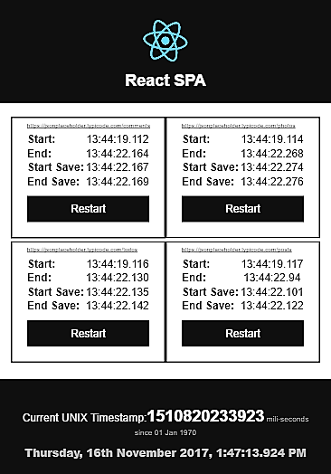

# React SPA
A Single Page Application, build using React and React Scripts. This is an under a task, given by [CARNOT Technologies](https://www.carsense.in/).

### Setup and Installation:
1) Clone the repository: 
`
  git clone https://github.com/BashCloud/reactSPA.git
`
2) Start the local server:
`
  npm start
`
Firstly, It will install all the dependencies via node package manager, then runs a local server, and serve the webpacked dynamic files.
3) Open this URL in Browser: 
`
  http://localhost:3000
` to watch all the live changes.

### BUILD the project for Optimized Distribution:
`
npm run build
` It will generate a build folder, that contains production ready files.

### DEPLOY directly on the GitHub-Pages:
` npm run deploy ` After successful deployment, visit: https://bashcloud.github.io/reactSPA/ for live hosted preview.

### Mobile Responsive screenshot

